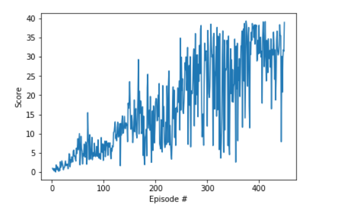

# Report

## Learning algorithm

The Deep Deterministic policy gradient (DDPG) algorithm is implemented for solving the environment.
The reason for using this algorithm is the continuous action space. It is not feasible to use Q-learning in such a scenario, because it would require an optimization of the action at every timestep.
The DDPG uses two neural networks (actor & critic). The actor network approximates the optimal policy 
by mapping states to the best actions deterministically. 
The critic then uses these best actions to evaluate the action-value function.

DDPG (like DQN) uses a replay buffer. The updates in the DDPG case are so called "soft target updates". 
In contrast to directly copying the weights from the current network to the target network (as done in DQN), 
soft updates slowly blend in a small amount of the regular network weights (e.g. 0.01%) to the target network weights. This improves the stability of learning.

To explore better policies, noise is sampled into the actor policy. To generate noise a normal distribution is used (Ornstein-Uhlenbeck process). [[1]](https://arxiv.org/abs/1509.02971)


### Neural network model architecture
The network architecture is similar to the one that is presented in the DDPG paper and consists of an actor and a critic network. 

Actor:
* Layer 1: 33 input - 400 output
* Layer 2: 400 input - 300 output
* Layer 3: 300 input - 4 output

Critic:
* Layer 1: 33 input - 400 output
* Layer 2: 404 input - 300 output
* Layer 3: 300 input - 4 output 

### DQN parameters

An agent produces experience tuples (action, state, reward, next state) with every step in the environment. 
The DDPG stores these in the replay buffer. 
Every 20 time steps, the networks are updated 10 times. 
One update consists of sampling a batch size (1024) of experiences from the replay buffer
and then updating the actor network, the critic network and the target networks of both.
As suggested in the Udacity course, gradient clipping is used when updating the critic network. 

* Time steps per episode: 1000
* Discount factor: 0.99
* Replay buffer size: 1e6
* Batch size: 1024
* Timesteps between learning: 20
* Learning rate of the actor:  1e-4
* Learning rate of the critic:  1e-3
* Soft update parameter tau: 1e-3

### Results



```
Episode 100	Average Score: 4.03
Episode 200	Average Score: 11.48
Episode 300	Average Score: 18.93
Episode 400	Average Score: 26.77
Episode 449	Average Score: 30.03
Environment solved in 449 episodes!	Average Score: 30.03
```


### Possible future work

* make the agent learn from pixel input
* solve the environment for multiple agents
* implement batch normalization
